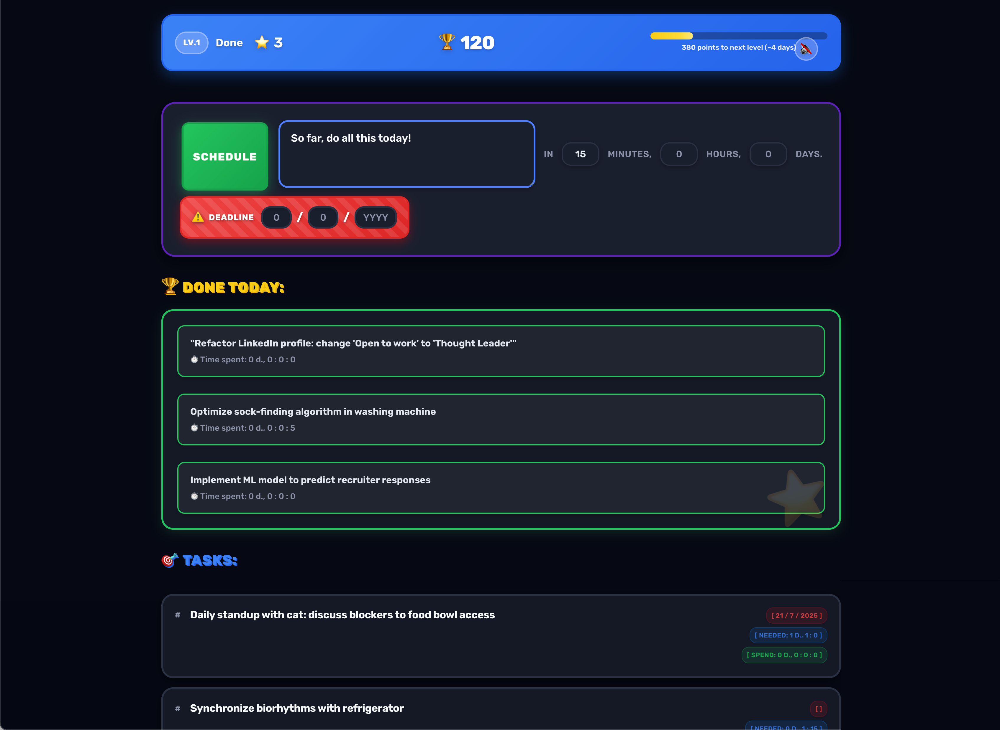
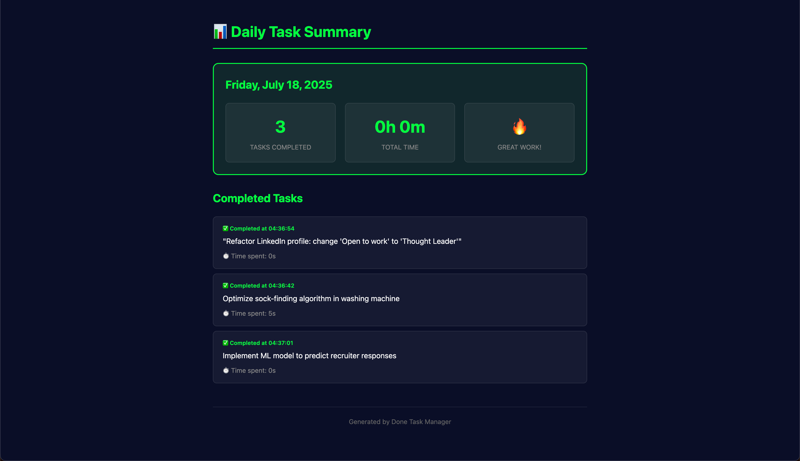

# Done

<p align="center">
  
  
  
</p>

A beautiful, NinStyle-inspired gamified task manager that rewards efficiency and consistency. Built with Go and vanilla JavaScript for maximum performance.



## Demo Video

[](https://www.youtube.com/watch?v=S9Db7y74A5c)

## Features

- 🎮 **Advanced Gamification** - Database-backed point system with streaks, achievements, and smart predictions
- ⚡ **Fast & Native** - Lightweight Go backend with native window support
- 🌙 **Dark Mode** - Beautiful dark theme with NinStyle-inspired design
- 🎯 **Smart Tasks** - Time tracking, deadlines, and drag-and-drop reordering
- 💾 **Local First** - Your data stays on your machine (`~/tasks.db`)
- 🍎 **macOS App** - Native .app bundle with WKWebView
- 📊 **Beautiful Reports** - Daily HTML reports saved to `~/tasksReport/`
- 🏆 **Golden Victory Screen** - Completed tasks displayed in celebratory style
- 📌 **Sticky Header** - Schedule section stays visible while scrolling
- 🔊 **Sound Effects** - NinStyle audio feedback (toggleable)

## Installation

### macOS App

```bash
# Build from source
git clone https://github.com/trukhinyuri/done.git
cd done
./build.sh --app
open bin/Done.app
```

### Command Line

```bash
# Build and run
git clone https://github.com/trukhinyuri/done.git
cd done
./build.sh
./done
```

Visit http://localhost:3001

## Usage

1. **Add Task** - Enter task name and estimated time
2. **Set Deadline** - Optional deadline with smart date auto-completion
3. **Start Working** - Click task to expand controls and start timer
4. **Complete** - Mark as done to earn points based on efficiency
5. **View Progress** - Check your daily achievements in the golden "Done Today" section

### Keyboard Shortcuts

- `Cmd/Ctrl + Enter` - Quick add task
- `Cmd/Ctrl + V` - Paste from clipboard (works in all fields)
- `Escape` - Cancel dialogs

### Gamification System

All gamification data is now stored in the database for persistence across sessions.

#### Point Calculation

**Base Points:**
- 10 points - Tasks < 1 hour
- 25 points - Tasks 1-2 hours  
- 50 points - Tasks > 2 hours

**Bonuses:**
- **+10 points** - Complete before deadline
- **Streak bonus** - Increases with consecutive days
- **Level bonus** - 500 points when leveling up

#### Levels

1. **Done** (0 points)
2. **Apprentice** (500 points)
3. **Journeyman** (1,500 points)
4. **Expert** (3,000 points)
5. **Master** (5,000 points)
6. **Champion** (8,000 points)
7. **Hero** (12,000 points)
8. **Legend** (17,000 points)
9. **Mythic** (25,000 points)
10. **Deity** (50,000 points)

#### Achievements

- 🎯 **First Steps** - Complete your first task
- 🔥 **On Fire** - 3 day streak
- ⚡ **Week Warrior** - 7 day streak
- 🌟 **Monthly Master** - 30 day streak
- 💎 **Point Collector** - Earn 1,000 points
- 👑 **Point Master** - Earn 5,000 points

## Reports

Daily HTML reports are automatically generated in `~/tasksReport/` with:
- Individual task completions with timestamps
- Beautiful dark theme matching the app
- Daily summaries with statistics
- Task completion times and durations



## Development

### Prerequisites

- Go 1.21+
- Chrome or Safari (for app mode)

### Build

```bash
# Development
go run done.go

# Production binary
./build.sh

# macOS app bundle
./build.sh --app

# All platforms
./build.sh --all
```

### Project Structure

```
done/
├── done.go                 # Main server
├── frontend/              # Web UI
│   ├── index.html
│   ├── index.css         # NinStyle-inspired theme
│   ├── gamification.js   # Points & achievements
│   └── *.js              # Vanilla JavaScript
├── lib/
│   ├── database/         # Task & gamification storage (BoltDB)
│   └── webview/          # Native window support
└── build.sh              # Build script
```

### API

| Method | Endpoint | Description |
|--------|----------|-------------|
| GET | `/api/getTasks` | List all tasks |
| POST | `/api/addTask` | Create task |
| POST | `/api/completeTask` | Mark as done & update gamification |
| POST | `/api/removeTask` | Delete task |
| POST | `/api/rearrangeTasks` | Reorder |
| GET | `/api/getGamification` | Get points, streaks, level |
| POST | `/api/updateGamification` | Update gamification data |
| GET | `/api/getTodayResults` | Get today's completed tasks |

### Docker

```bash
docker build -t done .
docker run -p 3001:3001 -v ~/tasks.db:/tasks.db -v ~/tasksReport:/tasksReport done
```

## Configuration

```bash
done -help
  -port int        Port (default 3001)
  -dbpath string   Database path (default "~/tasks.db")
  -native         Open in native window
  -chrome         Open in Chrome app mode
```

## Recent Updates

- **Database-backed Gamification** - Points, streaks, and achievements now persist in database
- **Golden Victory Screen** - "Done Today" section with celebratory golden theme
- **Beautiful Reports** - HTML reports with dark theme saved to `~/tasksReport/`
- **Smart Predictions** - Days to next level calculated only after completing tasks
- **UI Improvements** - Fixed hover effects, improved text formatting

## Contributing

Pull requests are welcome! For major changes, please open an issue first.

## License

[MIT](LICENSE)

---

<p align="center">
  <a href="https://github.com/trukhinyuri/done/issues">Report Bug</a> •
  <a href="https://github.com/trukhinyuri/done/issues">Request Feature</a>
</p>