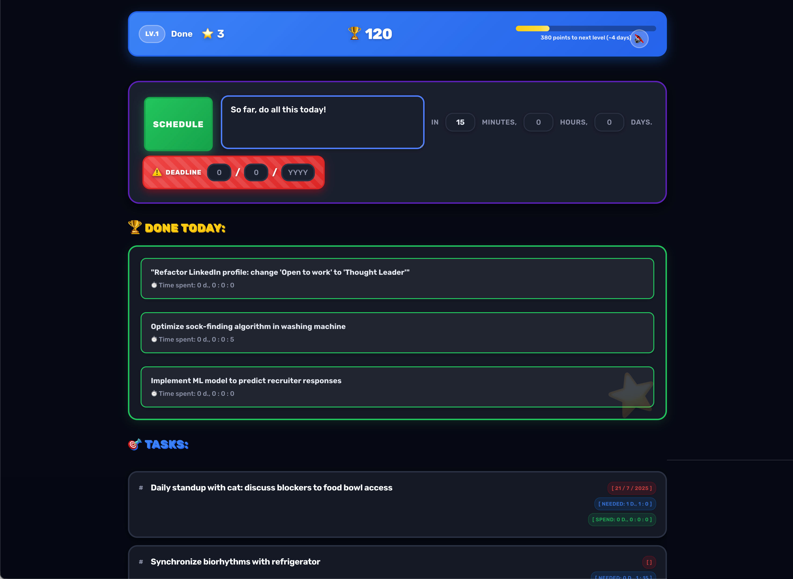

# Done

Done is a local-first task manager for focused personal and team work. It runs a small Go HTTP server, stores data in BoltDB, and serves a calm vanilla JavaScript interface designed for repeated daily use.

The default server binds to `127.0.0.1` and stores data in `~/tasks.db`, so normal desktop use keeps tasks on the local machine.



## Features

- Local-first task storage with BoltDB
- Calm task composer with estimates, deadlines, edit mode, and keyboard submit
- Active task list with time tracking, completion, deletion, reordering, and accessible Up/Down controls
- Done Today view for completed work
- Database-backed points, levels, streaks, and achievements
- Daily HTML reports saved to `~/tasksReport/` when tasks are completed
- Native macOS app bundle support with WKWebView
- Docker image support for explicit server deployments

## Installation

### macOS App

```bash
git clone https://github.com/trukhinyuri/done.git
cd done
./build.sh --app
open bin/Done.app
```

### Command Line

```bash
git clone https://github.com/trukhinyuri/done.git
cd done
./build.sh
./done
```

Open [http://localhost:3001](http://localhost:3001).

## Usage

1. Add a task with the next concrete step.
2. Set an optional estimate and deadline.
3. Start and stop the timer while working.
4. Edit, reorder, delete, or complete tasks from the task controls.
5. Review completed work in Done Today and in `~/tasksReport/`.

### Keyboard Shortcuts

- `Cmd/Ctrl + Enter` adds or updates the current task.
- Standard clipboard shortcuts work in task and date fields.
- `Escape` closes confirmation dialogs.

## Gamification

Gamification state is stored in BoltDB and is updated when tasks are completed.

### Point Calculation

- 10 points for tasks under 1 hour
- 25 points for tasks over 1 hour
- 50 points for tasks over 2 hours
- 10 bonus points for completing before a real deadline

### Levels

Levels advance every 100 points:

| Level | Title | Points |
| --- | --- | --- |
| 1 | Done | 0 |
| 2 | Apprentice | 100 |
| 3 | Journeyman | 200 |
| 4 | Expert | 300 |
| 5 | Master | 400 |
| 6 | Champion | 500 |
| 7 | Hero | 600 |
| 8 | Legend | 700 |
| 9 | Mythic | 800 |
| 10 | Deity | 900 |

## Development

### Prerequisites

- Go 1.21+
- Chrome or Safari for app mode
- `clang` on macOS when building the native launcher

### Build

```bash
go run done.go
go build -o done .
./build.sh
./build.sh --app
./build.sh --all
```

### Configuration

```bash
done -help
  -host string     Service host (default "127.0.0.1")
  -port int        Service port (default 3001)
  -dbpath string   Database path (default "~/tasks.db")
  -native          Open in native window
  -chrome          Open in Chrome app mode
  -version         Show app version
```

Use `-host 0.0.0.0` only for deployment scenarios where the API is intentionally exposed by the surrounding environment.

### Project Structure

```text
done/
├── done.go                 # Main server and route setup
├── frontend/               # Vanilla JS web UI
│   ├── index.html
│   ├── index.css
│   ├── index.js
│   ├── gamification.js
│   └── templates/task/
├── lib/
│   ├── database/           # HTTP handlers and database contracts
│   ├── database/bolt/      # BoltDB implementation
│   └── webview/            # Native window support
└── build.sh                # Build and package script
```

## API

| Method | Endpoint | Description |
| --- | --- | --- |
| GET | `/api/version` | Get build information |
| GET | `/api/getTasks` | List active tasks |
| POST | `/api/addTask` | Create a task |
| POST | `/api/updateTask` | Update an existing task |
| POST | `/api/completeTask` | Mark a task done and update gamification |
| POST | `/api/removeTask` | Delete a task |
| POST | `/api/rearrangeTasks` | Reorder tasks |
| POST | `/api/updateTaskExecutionRealSeconds` | Update task timer seconds |
| GET | `/api/getGamification` | Get points, streaks, level, and achievements |
| POST | `/api/updateGamification` | Update gamification data |
| GET | `/api/getTodayResults` | Get today's completed tasks |

The task write endpoints accept the current JSON payloads used by the frontend. Some legacy text formats are still accepted for backward compatibility.

## Docker

```bash
docker build -t done .
docker run -p 3001:3001 -v done-data:/data done
```

The Docker image explicitly starts the server with `-host 0.0.0.0` and stores the database at `/data/tasks.db`.

## Validation

Useful local checks:

```bash
go test ./...
go vet ./...
go test -race ./...
node --check frontend/index.js
node --check frontend/templates/task/task.js
node --check frontend/gamification.js
go build -o /tmp/done-check .
```

## License

[MIT](LICENSE)
